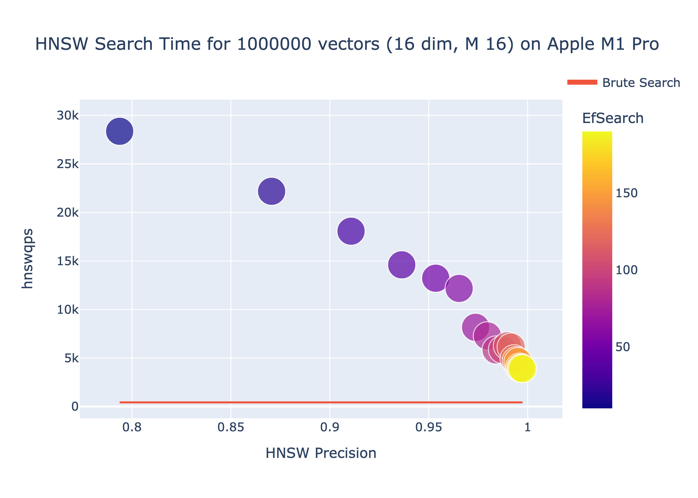

# Go (fast) HNSW

This project is a reference implementation of the [Hierarchical Navigable Small World graph](https://arxiv.org/pdf/1603.09320.pdf) paper by Malkov & Yashunin (2018) as a companion to the AWS presentation by Ben Duncan *What you need to know about Vector Databases. From use-cases to a deep dive on the technology*  

*NOTE: This repository will be moved to github.com/aws-samples shortly*

The project is designed for educational & benchmarking purposes. The project compares the speed of the HNSW graph for k-NN search, the impact of settings to create the HNSW graph (M, mmax, mmax0, efConstruction, efSearch) compared to a naive (brute-search) implementation.

## Usage

Build (go > 1.21.0 recommended)

```
make build
```

Run the benchmark for 1 million vectors (16 dimensions)

```
./bin/vecbench -num 1000000 -m 16 -mmax 16 -mmax0 32 -ef 200 -size 16 -csvfile benchmarks/1m.csv
```

Example output:

```
Total searches 1000000
Total matches from ground Truth: 9654061
Average 10-NN precision: 0.965406
HNSW efSearch (70):

HNSW Stats:
h.M = 16
h.Mmax = 16
h.Mmax0 = 32
h.Efconstruction = 200
h.Ep = 447724
h.Maxlevel = 5
h.Heuristic = true
h.Ml = 0.360674

Number of nodes = 1000000
        Level 0, number of nodes 937441, number of connections 25710940, avg 25
        Level 1, number of nodes 58480, number of connections 1000928, avg 16
        Level 2, number of nodes 3828, number of connections 65248, avg 16
        Level 3, number of nodes 230, number of connections 4000, avg 16
        Level 4, number of nodes 18, number of connections 320, avg 16
        Level 5, number of nodes 2, number of connections 0, avg 0
Total number of node levels = 6
HNSW search complete in 122.544270 (secs)
HNSW search queries per second 8160.316251 (8 threaded)
HNSW search queries per second 1020.039531 (Single threaded)
```

Note, the benchmark tool will create the specified number of vectors in a HNSW graph, conduct a brute-search for every element to find the top k-NN (10) and used as a ground-truth reference.

Once complete a HNSW search will run for the entire dataset to find the k-NN with a stepped `efSearch` paramater (in 10 increments) to reach the HNSW `ef` paramater used to create the index. This is used to change the accuracy of the search and speed, demonstrating the queries per second (qps) that can be achieved.

## Benchmark

To benchmark the results open the Jupyter Notebook `benchmarks/gengraph.ipynb` replacing

```
filename = "1m-m16-16d-200ef.csv"
```

With the CSV file created in the prior step.



In addition, an interactive HTML version will be generated in the benchmarks directory.

